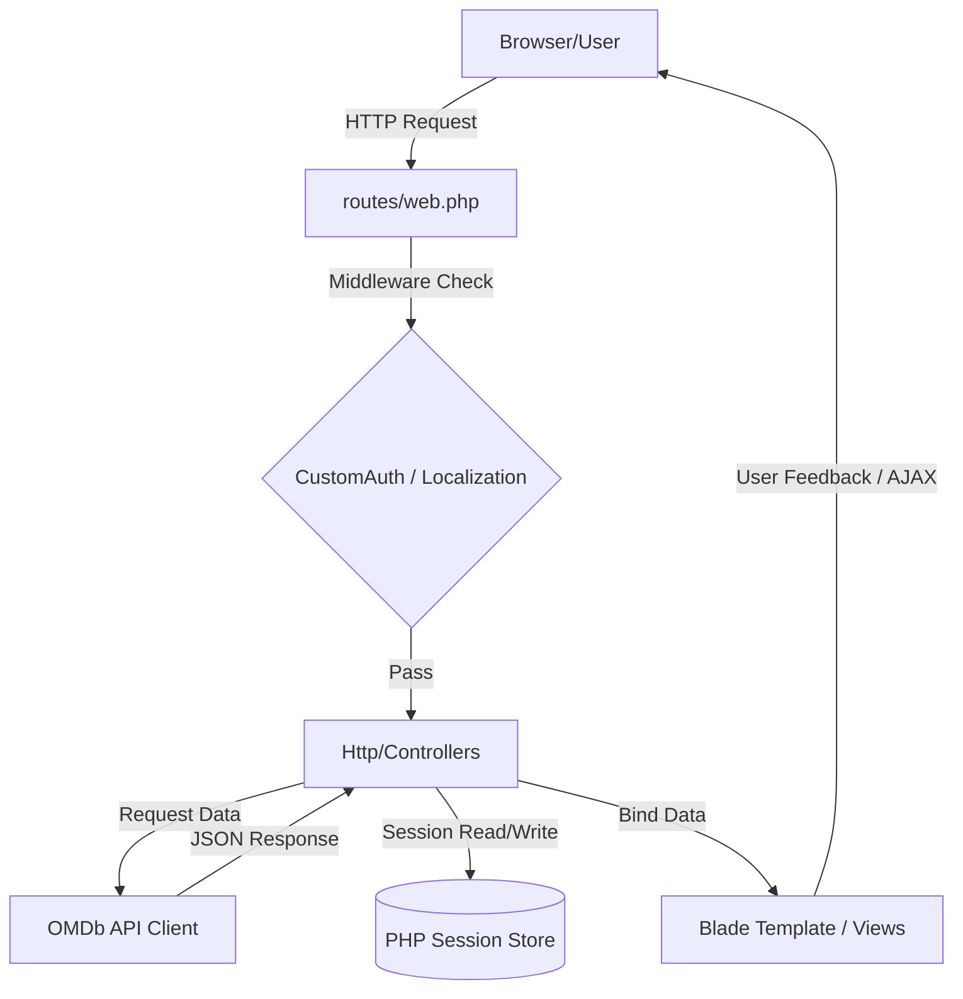

# Dokumentasi Arsitektur - Movie Catalog Application

Dokumen ini menjelaskan arsitektur perangkat lunak, pola desain, alur data, serta keputusan teknis yang diimplementasikan dalam aplikasi **Movie Catalog** (Proyek Uji Teknis - PT Aldmic COOPN Digital).

---

## 📌 1. Ikhtisar Sistem (System Overview)

Aplikasi Movie Catalog adalah sistem berbasis web satu-halaman utama (single-portal) yang terintegrasi secara langsung dengan **OMDb API** untuk pencarian dan penayangan detail film. Aplikasi ini dirancang agar ringan, cepat, dan mudah di-deploy dengan mengadopsi konsep **Database-less Architecture** (Arsitektur Tanpa Database).

### 🛠️ Fitur Utama & Keunggulan
1. **Database-less Authentication**: Login menggunakan kredensial statis terproteksi melalui middleware kustom.
2. **Session-Driven Storage**: Penyimpanan film favorit menggunakan struktur memori sesi PHP (Session Array) untuk efisiensi komputasi server.
3. **Infinite Scroll (AJAX-Driven)**: Pemuatan data film pada halaman pencarian secara dinamis saat pengguna menggulir halaman ke bawah (scroll), meminimalkan beban pemuatan awal halaman.
4. **Image Lazy Loading**: Penundaan pemuatan gambar poster film yang belum masuk ke dalam viewport menggunakan library `lazysizes.min.js`.
5. **Localization (Multi-Bahasa)**: Dukungan dinamis untuk Bahasa Indonesia (ID) dan Bahasa Inggris (Default: EN).
6. **Robust AJAX Handlers**: Operasi penambahan dan penghapusan favorit diproses di latar belakang secara asinkronus (tanpa memuat ulang halaman/reload) dengan *smooth feedback visual* (Bootstrap alerts).

---

## 🏛️ 2. Pola Arsitektur (Architectural Pattern)

Aplikasi ini menggunakan pola arsitektur **MVC (Model-View-Controller)** standar bawaan Laravel 5.8, dengan beberapa adaptasi khusus karena tidak adanya database fisik:



### A. Layer Rute (Routing Layer)
Semua rute didefinisikan dalam `routes/web.php` dan dilindungi oleh dua lapis middleware utama:
*   **Web Middleware Group**: Mengelola cookie, enkripsi, dan inisialisasi session.
*   **Localization Middleware**: Menerapkan bahasa aktif berdasarkan session di setiap request.
*   **CustomAuth Middleware**: Memproteksi rute internal (seperti daftar film, detail, dan favorit) agar hanya dapat diakses oleh pengguna yang sudah terautentikasi.

### B. Layer Pengontrol (Controller Layer)
Mengatur logika alur kerja aplikasi dan berinteraksi dengan API eksternal serta session penyimpanan:
1.  **`AuthController`**: Mengatur proses login hardcoded (`username: aldmic`, `password: 123abc123`), menyimpan state masuk ke session (`user_logged`), serta menghapusnya saat logout.
2.  **`MovieController`**: Bertanggung jawab melakukan HTTP request server-to-server ke OMDb API menggunakan Guzzle HTTP Client. Menghandle request halaman utama biasa dan request data asinkron (AJAX) untuk infinite scroll.
3.  **`FavoriteController`**: Mengelola penambahan, penampilan, dan penghapusan data film favorit di dalam array session.
4.  **`LanguageController`**: Menyimpan pilihan bahasa baru (ID/EN) ke dalam session pengguna dan mengembalikan ke halaman sebelumnya.

### C. Layer Tampilan (View Layer)
Menggunakan **Laravel Blade Template Engine** yang dikombinasikan dengan library frontend modern:
*   **Bootstrap 4.6.2 & HTML5 Semantic Elements**: Untuk tata letak (layout) yang responsif dan estetika premium.
*   **jQuery 3.5.1**: Untuk memanipulasi DOM, mengirim AJAX Request (CSRF-safe), serta memicu efek transisi dinamis (seperti fadeOut saat film favorit dihapus).
*   **`lazysizes` (Lazy Loading)**: Menerapkan pemuatan gambar poster film secara cerdas menggunakan atribut `data-src` dan kelas CSS `lazyload`.

---

## 💾 3. Detail Mekanisme & Penyimpanan (Mechanisms Detail)

### 🔑 3.1 Autentikasi Tanpa Database (Database-less Auth)
Karena aplikasi ini dibuat untuk kebutuhan uji teknis yang mandiri (portable), proses autentikasi tidak memerlukan tabel `users`.
*   **Proses Login**:
    ```php
    // AuthController.php
    if ($username === 'aldmic' && $password === '123abc123') {
        $request->session()->put('user_logged', true);
        return redirect('/');
    }
    ```
*   **Proses Proteksi**:
    Middleware `CustomAuth` mencegat setiap request pada rute internal. Jika session key `user_logged` tidak ditemukan, pengguna langsung diredireksi kembali ke halaman login.
    ```php
    // CustomAuth.php
    if (!$request->session()->has('user_logged')) {
        return redirect('login')->withErrors([trans('messages.login_required')]);
    }
    ```

### ⭐️ 3.2 Session-Driven Favorites
Data film favorit disimpan sebagai array asosiatif di dalam Session dengan kunci `favorites`. Struktur ini sangat efisien karena beroperasi langsung di memori server tanpa latency database.
*   **Struktur Data Sesi**:
    ```json
    {
      "favorites": {
        "tt0111161": {
          "imdbID": "tt0111161",
          "Title": "The Shawshank Redemption",
          "Year": "1994",
          "Poster": "https://images.com/shawshank.jpg"
        }
      }
    }
    ```
*   **Pencegahan Duplikasi**:
    Sebelum menyimpan film, `FavoriteController` memeriksa keberadaan indeks `imdbID` untuk menghindari duplikasi data:
    ```php
    if (!isset($favorites[$movieId])) {
        $favorites[$movieId] = [ ... ];
        session()->put('favorites', $favorites);
    }
    ```

### 🌍 3.3 Localization (Multi-Bahasa)
Sistem lokalisasi memanfaatkan middleware untuk menetapkan *locale* aktif secara dinamis di setiap siklus HTTP request.
1.  Pengguna menekan tombol switch bahasa (rute: `/lang/{locale}`).
2.  `LanguageController` memperbarui session key `locale` dengan nilai `id` atau `en`.
3.  Di request berikutnya, middleware `Localization` memanggil `App::setLocale()` sesuai nilai session tersebut.
4.  Blade template merender teks terjemahan melalui helper `trans('messages.key_name')` atau `{{ __('messages.key_name') }}`.

---

## 🔌 4. Integrasi OMDb API

Integrasi data eksternal difasilitasi oleh **Guzzle HTTP Client** di dalam `MovieController`.

### 🛰️ Spesifikasi Endpoint & Parameter
*   **Base URL**: `http://www.omdbapi.com/`
*   **API Key Default**: `6f525d05` (Dimasukkan sebagai parameter query `apikey`).
*   **Pencarian Film (List)**:
    *   Parameter: `s` (Kata kunci pencarian, default pencarian awal jika tidak diisi adalah string pencarian aktif).
    *   Parameter: `page` (Paginasi halaman ke-n, digunakan untuk request scroll selanjutnya).
*   **Detail Film**:
    *   Parameter: `i` (IMDb ID unik film, misal `tt3896198`).
    *   Parameter: `plot` (Ditetapkan `full` untuk mengambil sinopsis lengkap).

### 🛠️ Penanganan Kegagalan (Fault Tolerance)
Semua panggilan API dibungkus dalam blok `try-catch` guna mendeteksi kegagalan jaringan atau timeout dari server OMDb:
```php
try {
    $response = $client->get($this->baseUrl, ['query' => $params]);
    return json_decode($response->getBody()->getContents(), true);
} catch (\Exception $e) {
    return ['Response' => 'False', 'Error' => $e->getMessage()];
}
```

---

## ⚡ 5. Optimasi Kinerja Frontend

Aplikasi ini menggunakan teknik optimasi modern guna menjamin kenyamanan maksimal bagi pengguna:

### 🔄 5.1 Infinite Scroll
*   Saat pengguna mendekati bagian bawah layar browser, event listener jQuery mendeteksi posisi scroll.
*   Jika terpicu, AJAX request dikirim ke backend dengan parameter `page` berikutnya (misal `page=2`).
*   Backend mengembalikan data berupa JSON.
*   jQuery merender elemen HTML secara dinamis dan menyematkannya (*append*) ke dalam kontainer film tanpa perlu memuat ulang seluruh halaman.

### 🖼️ 5.2 Lazy Loading (lazysizes)
Poster film dari OMDb API dapat berukuran besar dan memperlambat waktu muat halaman (Page Load Time).
*   **Implementasi**: Tag `` diatur dengan mengganti atribut `src` menjadi `data-src` dan menambahkan class `lazyload`.
*   **Cara Kerja**: Library `lazysizes.min.js` memantau viewport. Begitu elemen gambar mendekati viewport pengguna, atribut `data-src` akan diubah secara otomatis menjadi `src` asli, sehingga menghemat konsumsi kuota data internet pengguna dan mempercepat rendering awal halaman.

---

## 🔒 6. Aspek Keamanan (Security)

1.  **CSRF Protection**: Laravel mewajibkan token CSRF pada metode non-read (POST, DELETE). Dalam aplikasi ini, token dikirim secara otomatis pada setiap AJAX request melalui pengaturan global jQuery:
    ```javascript
    $.ajaxSetup({
        headers: {
            'X-CSRF-TOKEN': $('meta[name="csrf-token"]').attr('content')
        }
    });
    ```
2.  **Input Sanitization**: Saat melakukan AJAX request untuk pencarian film, input kata kunci disanitasi menggunakan `encodeURIComponent()` untuk mencegah malformasi URL query string.
3.  **Authentication Guard**: Semua rute penting dibatasi menggunakan `custom.auth` middleware untuk mencegah *Direct Link Access* ke halaman beranda, favorit, atau detail tanpa melalui form login.
